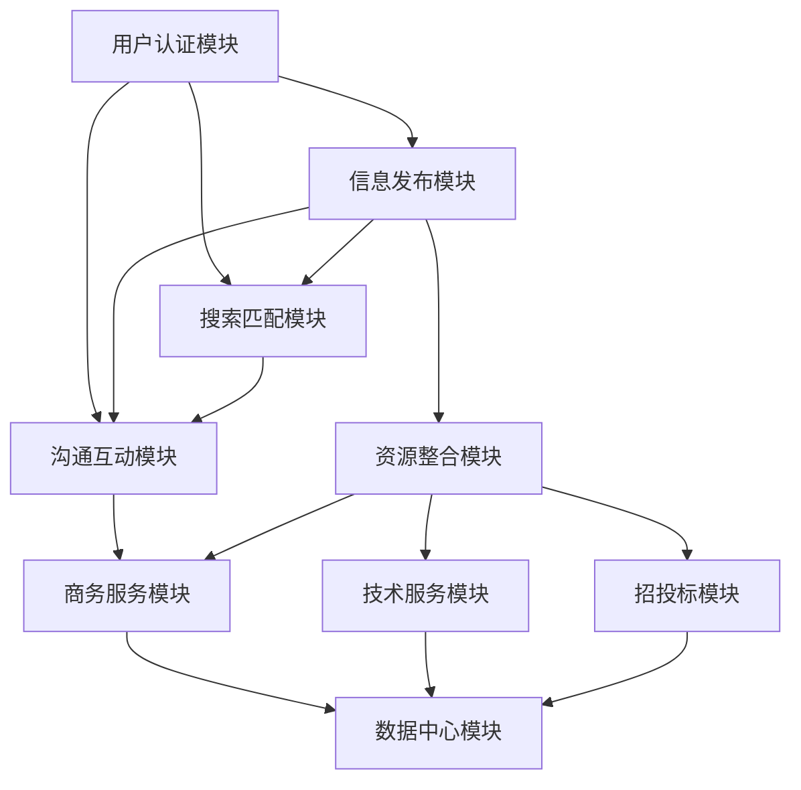
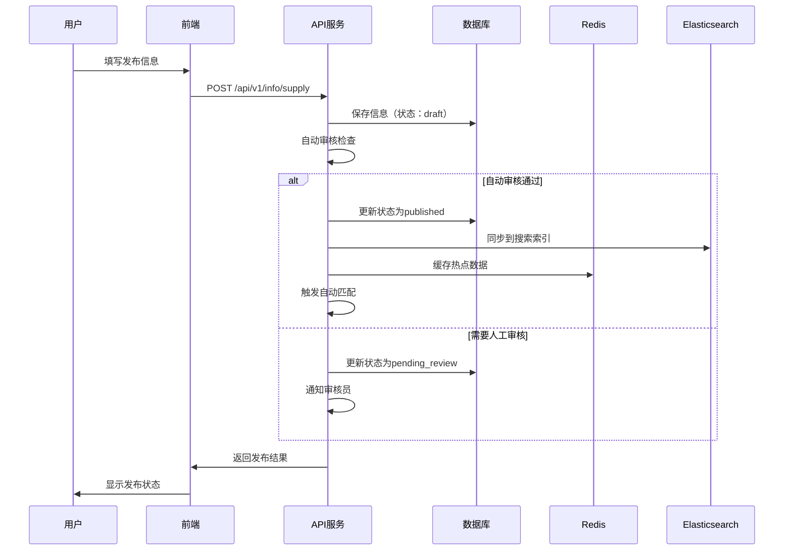
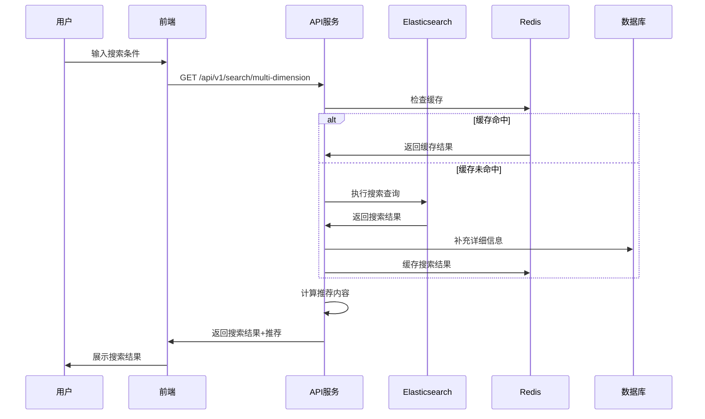

# 防腐保温智慧平台功能模块设计文档

## 1. 模块架构概述

### 1.1 系统模块划分
```
防腐保温智慧平台
├── 用户认证与权限管理模块 (authentication)
├── 信息发布系统模块 (info_publish)
├── 搜索与匹配系统模块 (search_match)
├── 沟通互动系统模块 (communication)
├── 资源整合中心模块 (resources)
├── 商务服务平台模块 (business)
├── 智能技术服务平台模块 (tech_service)
├── 智能招投标平台模块 (bidding)
├── 数据中心模块 (data_center)
└── 公共模块 (common)
```

### 1.2 模块依赖关系


## 2. 核心模块详细设计

### 2.1 用户认证与权限管理模块

#### 2.1.1 模块职责
- 用户注册、登录、登出
- JWT Token管理
- 用户信息管理
- 权限控制和角色管理
- 企业认证审核

#### 2.1.2 核心功能
```python
# 用户角色定义
USER_ROLES = {
    'enterprise': {
        'manufacturer': '生产制造企业',
        'constructor': '施工安装企业', 
        'owner': '工程甲方企业',
        'supplier': '供应商企业'
    },
    'individual': {
        'technician': '技术人员/工程师',
        'worker': '施工人员/劳务人员',
        'expert': '行业专家/顾问',
        'purchaser': '采购人员/项目经理',
        'bidder': '投标专员'
    }
}

# 权限定义
PERMISSIONS = {
    'info_publish': '信息发布权限',
    'search_match': '搜索匹配权限',
    'communication': '沟通交流权限',
    'inventory_manage': '库存管理权限',
    'quotation_manage': '报价管理权限',
    'demand_publish': '需求发布权限',
    'bidding_participate': '投标参与权限',
    'tender_publish': '招标发布权限',
    'project_manage': '项目管理权限',
    'job_search': '求职权限',
    'tech_consultation': '技术咨询权限'
}
```

#### 2.1.3 关键接口
- `POST /api/v1/auth/register` - 用户注册
- `POST /api/v1/auth/login` - 用户登录
- `POST /api/v1/auth/logout` - 用户登出
- `GET /api/v1/auth/profile` - 获取用户信息
- `PUT /api/v1/auth/profile` - 更新用户信息
- `POST /api/v1/auth/enterprise/verify` - 企业认证

### 2.2 信息发布系统模块

#### 2.2.1 模块职责
- 多类型信息发布管理
- 信息审核流程
- 信息状态管理
- 自动化推送机制

#### 2.2.2 信息类型定义
```python
INFO_TYPES = {
    'supply': {
        'name': '供应信息',
        'publisher': ['supplier'],
        'fields': ['product_name', 'technical_params', 'inventory_quantity', 'unit_price']
    },
    'demand': {
        'name': '采购需求',
        'publisher': ['manufacturer', 'constructor', 'owner'],
        'fields': ['product_type', 'purchase_quantity', 'quality_requirements', 'budget_amount']
    },
    'recruitment': {
        'name': '招聘信息',
        'publisher': ['manufacturer', 'constructor', 'owner', 'supplier'],
        'fields': ['position_name', 'position_type', 'salary_range', 'work_location']
    },
    'cooperation': {
        'name': '项目合作',
        'publisher': ['manufacturer', 'constructor', 'owner'],
        'fields': ['project_name', 'project_type', 'cooperation_budget', 'project_period']
    },
    'question': {
        'name': '技术问题',
        'publisher': ['all'],
        'fields': ['question_category', 'question_title', 'question_detail']
    },
    'bidding': {
        'name': '招投标',
        'publisher': ['owner'],
        'fields': ['project_name', 'project_budget', 'bidding_deadline', 'qualification_requirements']
    }
}
```

#### 2.2.3 审核流程设计
```python
# 审核状态流转
REVIEW_STATUS_FLOW = {
    'draft': ['pending_review'],           # 草稿 -> 待审核
    'pending_review': ['approved', 'rejected', 'revision_required'],  # 待审核 -> 通过/驳回/需修改
    'revision_required': ['pending_review'],  # 需修改 -> 待审核
    'approved': ['published', 'offline'],     # 通过 -> 发布/下线
    'rejected': [],                           # 驳回（终态）
    'published': ['offline', 'expired'],      # 发布 -> 下线/过期
    'offline': ['published'],                 # 下线 -> 发布
    'expired': []                            # 过期（终态）
}

# 自动审核规则
AUTO_REVIEW_RULES = {
    'sensitive_words': {
        'action': 'reject',
        'words': ['政治敏感词', '违法词汇', '色情词汇']
    },
    'required_fields': {
        'action': 'revision_required',
        'check': 'all_required_fields_filled'
    },
    'file_format': {
        'action': 'revision_required',
        'allowed_formats': ['jpg', 'png', 'pdf', 'doc', 'docx']
    },
    'qualification_check': {
        'action': 'pending_manual_review',
        'condition': 'supplier_without_certification'
    }
}
```

### 2.3 搜索与匹配系统模块

#### 2.3.1 搜索维度设计
```python
SEARCH_DIMENSIONS = {
    'keyword': {
        'type': 'text',
        'search_fields': ['name', 'description', 'tags'],
        'boost': {'name': 2.0, 'description': 1.0, 'tags': 1.5}
    },
    'region': {
        'type': 'nested',
        'levels': ['province', 'city', 'district'],
        'exact_match': True
    },
    'product_type': {
        'type': 'hierarchical',
        'levels': ['category_l1', 'category_l2'],
        'exact_match': True
    },
    'price_range': {
        'type': 'range',
        'field': 'unit_price',
        'operators': ['gte', 'lte']
    },
    'supplier_rating': {
        'type': 'term',
        'field': 'supplier.rating',
        'values': ['1star', '2star', '3star', '4star', '5star']
    },
    'delivery_period': {
        'type': 'range',
        'field': 'delivery_period',
        'ranges': {
            '1-3days': [1, 3],
            '3-7days': [4, 7],
            '7-15days': [8, 15],
            '15+days': [16, 999]
        }
    }
}
```

#### 2.3.2 智能推荐算法
```python
# 推荐算法权重配置
RECOMMENDATION_WEIGHTS = {
    'user_behavior': {
        'search_history': 0.30,      # 搜索历史
        'view_history': 0.25,        # 浏览历史
        'favorite_history': 0.20,    # 收藏历史
        'purchase_history': 0.40,    # 采购历史
        'inquiry_history': 0.35      # 询价历史
    },
    'content_similarity': {
        'product_type': 0.35,        # 产品类型相似度
        'technical_params': 0.25,    # 技术参数相似度
        'price_range': 0.20,         # 价格区间相似度
        'supplier_rating': 0.20      # 供应商评级相似度
    },
    'collaborative_filtering': {
        'similar_users': 0.30,       # 相似用户行为
        'popular_items': 0.20        # 热门商品
    }
}

# 匹配规则配置
MATCHING_RULES = {
    'product_type_match': {
        'weight': 0.35,
        'required': True,
        'exact_match': True
    },
    'region_match': {
        'weight': 0.20,
        'max_distance': 300,  # 公里
        'distance_decay': 0.1  # 距离衰减因子
    },
    'price_match': {
        'weight': 0.15,
        'tolerance': 0.10,  # 10%价格容差
        'prefer_lower': True
    },
    'delivery_period_match': {
        'weight': 0.15,
        'required': True,
        'prefer_shorter': True
    },
    'supplier_rating_match': {
        'weight': 0.15,
        'min_rating': '2star',
        'prefer_higher': True
    }
}
```

### 2.4 沟通互动系统模块

#### 2.4.1 消息类型设计
```python
MESSAGE_TYPES = {
    'text': {
        'name': '文本消息',
        'max_length': 500,
        'supports_emoji': True,
        'supports_mention': True
    },
    'file': {
        'name': '文件消息',
        'allowed_formats': ['pdf', 'doc', 'docx', 'xls', 'xlsx'],
        'max_size': 20 * 1024 * 1024,  # 20MB
        'virus_scan': True
    },
    'image': {
        'name': '图片消息',
        'allowed_formats': ['jpg', 'jpeg', 'png', 'gif'],
        'max_size': 5 * 1024 * 1024,   # 5MB
        'auto_compress': True
    },
    'quotation': {
        'name': '报价消息',
        'structured_data': True,
        'fields': ['product_id', 'quantity', 'unit_price', 'total_amount', 'validity_period']
    },
    'system': {
        'name': '系统消息',
        'auto_generated': True,
        'types': ['order_status', 'payment_reminder', 'delivery_notification']
    }
}
```

#### 2.4.2 议价流程设计
```python
# 议价状态流转
NEGOTIATION_STATUS_FLOW = {
    'initiated': ['supplier_quoted'],           # 发起议价 -> 供应商报价
    'supplier_quoted': ['buyer_counter', 'buyer_accepted', 'buyer_rejected'],  # 供应商报价 -> 买方还价/接受/拒绝
    'buyer_counter': ['supplier_counter', 'supplier_accepted', 'supplier_rejected'],  # 买方还价 -> 供应商还价/接受/拒绝
    'supplier_counter': ['buyer_counter', 'buyer_accepted', 'buyer_rejected'],  # 供应商还价 -> 买方还价/接受/拒绝
    'buyer_accepted': ['order_created'],        # 买方接受 -> 创建订单
    'supplier_accepted': ['order_created'],     # 供应商接受 -> 创建订单
    'buyer_rejected': ['terminated'],           # 买方拒绝 -> 终止
    'supplier_rejected': ['terminated'],        # 供应商拒绝 -> 终止
    'order_created': [],                        # 订单创建（终态）
    'terminated': []                            # 终止（终态）
}

# 议价规则
NEGOTIATION_RULES = {
    'max_rounds': 5,                    # 最大议价轮次
    'timeout_hours': 48,                # 单轮超时时间（小时）
    'min_price_change': 0.01,           # 最小价格变动（1%）
    'auto_accept_threshold': 0.05       # 自动接受阈值（5%以内差异）
}
```

### 2.5 商务服务平台模块

#### 2.5.1 订单状态管理
```python
# 订单状态流转
ORDER_STATUS_FLOW = {
    'pending_confirm': ['confirmed', 'cancelled'],              # 待确认 -> 已确认/已取消
    'confirmed': ['production', 'cancelled'],                   # 已确认 -> 生产中/已取消
    'production': ['quality_check', 'cancelled'],               # 生产中 -> 质检/已取消
    'quality_check': ['shipped', 'production'],                # 质检 -> 已发货/返回生产
    'shipped': ['delivered', 'in_transit'],                    # 已发货 -> 已送达/运输中
    'in_transit': ['delivered', 'exception'],                  # 运输中 -> 已送达/异常
    'delivered': ['completed', 'return_requested'],            # 已送达 -> 已完成/申请退货
    'return_requested': ['returned', 'return_rejected'],       # 申请退货 -> 已退货/拒绝退货
    'completed': [],                                           # 已完成（终态）
    'cancelled': [],                                           # 已取消（终态）
    'returned': [],                                            # 已退货（终态）
    'exception': ['delivered', 'cancelled']                    # 异常 -> 已送达/已取消
}

# 状态变更权限
STATUS_CHANGE_PERMISSIONS = {
    'pending_confirm': ['buyer', 'supplier'],
    'confirmed': ['supplier'],
    'production': ['supplier'],
    'quality_check': ['supplier'],
    'shipped': ['supplier'],
    'delivered': ['buyer', 'logistics'],
    'completed': ['buyer'],
    'cancelled': ['buyer', 'supplier', 'admin'],
    'return_requested': ['buyer'],
    'returned': ['supplier', 'admin']
}
```

#### 2.5.2 库存管理设计
```python
# 库存操作类型
INVENTORY_OPERATIONS = {
    'purchase': '采购入库',
    'production': '生产入库',
    'sale': '销售出库',
    'return': '退货入库',
    'damage': '损耗出库',
    'transfer': '调拨',
    'adjustment': '盘点调整'
}

# 库存预警规则
INVENTORY_ALERT_RULES = {
    'low_stock': {
        'condition': 'current_quantity <= low_stock_threshold',
        'alert_level': 'warning',
        'notification_methods': ['sms', 'email', 'system'],
        'frequency': 'daily'
    },
    'out_of_stock': {
        'condition': 'current_quantity <= 0',
        'alert_level': 'critical',
        'notification_methods': ['sms', 'email', 'system', 'phone'],
        'frequency': 'immediate'
    },
    'overstock': {
        'condition': 'current_quantity >= overstock_threshold',
        'alert_level': 'info',
        'notification_methods': ['email', 'system'],
        'frequency': 'weekly'
    },
    'expiry_warning': {
        'condition': 'expiry_date <= CURRENT_DATE + 30',
        'alert_level': 'warning',
        'notification_methods': ['email', 'system'],
        'frequency': 'weekly'
    }
}
```

### 2.6 智能技术服务平台模块

#### 2.6.1 AI问答系统设计
```python
# 问题分类体系
QUESTION_CATEGORIES = {
    'material': {
        'name': '材料技术',
        'subcategories': {
            'coating': '涂料技术',
            'insulation': '保温材料',
            'sealant': '密封材料',
            'composite': '复合材料'
        }
    },
    'construction': {
        'name': '施工工艺',
        'subcategories': {
            'surface_treatment': '表面处理',
            'application': '涂装工艺',
            'quality_control': '质量控制',
            'safety': '安全施工'
        }
    },
    'equipment': {
        'name': '设备技术',
        'subcategories': {
            'spray_equipment': '喷涂设备',
            'testing_equipment': '检测设备',
            'safety_equipment': '安全设备'
        }
    }
}

# AI回答置信度阈值
AI_CONFIDENCE_THRESHOLDS = {
    'auto_answer': 0.90,        # 自动回答阈值
    'suggest_expert': 0.70,     # 推荐专家阈值
    'need_human': 0.50          # 需要人工处理阈值
}
```

#### 2.6.2 专家咨询系统
```python
# 专家等级体系
EXPERT_LEVELS = {
    'junior': {
        'name': '初级专家',
        'requirements': {
            'experience_years': 3,
            'certifications': 1,
            'answered_questions': 10
        },
        'hourly_rate_range': [100, 300]
    },
    'senior': {
        'name': '高级专家',
        'requirements': {
            'experience_years': 8,
            'certifications': 3,
            'answered_questions': 50,
            'satisfaction_rate': 0.85
        },
        'hourly_rate_range': [300, 800]
    },
    'master': {
        'name': '资深专家',
        'requirements': {
            'experience_years': 15,
            'certifications': 5,
            'answered_questions': 200,
            'satisfaction_rate': 0.90
        },
        'hourly_rate_range': [800, 2000]
    }
}
```

## 3. 数据流设计

### 3.1 信息发布流程


### 3.2 搜索匹配流程


## 4. 安全设计

### 4.1 数据安全
```python
# 敏感数据加密字段
ENCRYPTED_FIELDS = {
    'tx_enterprises': ['business_license', 'bank_account'],
    'tx_users': ['id_card_number', 'phone'],
    'tx_orders': ['payment_info'],
    'tx_contracts': ['contract_terms']
}

# 数据脱敏规则
DATA_MASKING_RULES = {
    'phone': lambda x: x[:3] + '****' + x[7:] if len(x) == 11 else x,
    'email': lambda x: x.split('@')[0][:2] + '***@' + x.split('@')[1],
    'id_card': lambda x: x[:6] + '********' + x[14:] if len(x) == 18 else x,
    'bank_account': lambda x: '****' + x[-4:] if len(x) > 4 else x
}
```

### 4.2 接口安全
```python
# 接口限流配置
RATE_LIMIT_RULES = {
    'login': '5/minute',           # 登录接口限制
    'register': '3/minute',        # 注册接口限制
    'sms_send': '1/minute',        # 短信发送限制
    'file_upload': '10/minute',    # 文件上传限制
    'search': '100/minute',        # 搜索接口限制
    'message_send': '50/minute'    # 消息发送限制
}

# IP黑名单管理
IP_BLACKLIST_RULES = {
    'auto_ban_threshold': 100,     # 自动封禁阈值（每小时请求数）
    'ban_duration': 24,            # 封禁时长（小时）
    'whitelist_ips': ['127.0.0.1', '10.0.0.0/8'],  # IP白名单
    'suspicious_patterns': [       # 可疑行为模式
        'rapid_registration',      # 快速注册
        'mass_inquiry',           # 批量询价
        'data_scraping'           # 数据爬取
    ]
}
```

## 5. 性能优化设计

### 5.1 缓存策略
```python
# 缓存层级设计
CACHE_LEVELS = {
    'L1_browser': {
        'type': 'browser_cache',
        'ttl': 300,  # 5分钟
        'resources': ['static_files', 'user_avatar']
    },
    'L2_cdn': {
        'type': 'cdn_cache',
        'ttl': 3600,  # 1小时
        'resources': ['product_images', 'documents']
    },
    'L3_redis': {
        'type': 'redis_cache',
        'ttl': 1800,  # 30分钟
        'resources': ['search_results', 'hot_products', 'user_sessions']
    },
    'L4_database': {
        'type': 'query_cache',
        'ttl': 600,   # 10分钟
        'resources': ['complex_queries', 'aggregation_results']
    }
}

# 缓存更新策略
CACHE_UPDATE_STRATEGIES = {
    'product_info': 'write_through',      # 写入时同步更新缓存
    'inventory': 'write_behind',          # 异步更新缓存
    'user_profile': 'cache_aside',        # 缓存旁路模式
    'search_results': 'ttl_based'         # 基于TTL的过期更新
}
```

### 5.2 数据库优化
```python
# 分表策略
SHARDING_STRATEGIES = {
    'tx_messages': {
        'strategy': 'time_based',
        'partition_by': 'created_at',
        'partition_interval': 'monthly',
        'retention_period': '2years'
    },
    'tx_audit_logs': {
        'strategy': 'time_based',
        'partition_by': 'created_at',
        'partition_interval': 'quarterly',
        'retention_period': '3years'
    },
    'tx_search_logs': {
        'strategy': 'hash_based',
        'partition_by': 'user_id',
        'partition_count': 16
    }
}

# 索引优化策略
INDEX_STRATEGIES = {
    'composite_indexes': [
        ('tx_products', ['product_type', 'status', 'created_at']),
        ('tx_orders', ['buyer_id', 'order_status', 'created_at']),
        ('tx_messages', ['conversation_id', 'created_at'])
    ],
    'partial_indexes': [
        ('tx_products', 'status = "published"'),
        ('tx_orders', 'order_status IN ("pending_confirm", "confirmed")')
    ]
}
```

## 6. 监控与告警

### 6.1 业务监控指标
```python
# 关键业务指标
BUSINESS_METRICS = {
    'user_metrics': {
        'daily_active_users': '日活跃用户数',
        'monthly_active_users': '月活跃用户数',
        'user_retention_rate': '用户留存率',
        'new_user_registration': '新用户注册数'
    },
    'content_metrics': {
        'daily_info_published': '日信息发布量',
        'search_success_rate': '搜索成功率',
        'match_success_rate': '匹配成功率',
        'response_rate': '响应率'
    },
    'transaction_metrics': {
        'daily_orders': '日订单量',
        'order_completion_rate': '订单完成率',
        'average_order_value': '平均订单价值',
        'payment_success_rate': '支付成功率'
    }
}
```

### 6.2 系统监控指标
```python
# 系统性能指标
SYSTEM_METRICS = {
    'api_performance': {
        'response_time_p95': 'API响应时间95分位',
        'requests_per_second': '每秒请求数',
        'error_rate': '错误率',
        'availability': '可用性'
    },
    'database_performance': {
        'query_time_avg': '平均查询时间',
        'slow_query_count': '慢查询数量',
        'connection_pool_usage': '连接池使用率',
        'deadlock_count': '死锁次数'
    },
    'cache_performance': {
        'hit_rate': '缓存命中率',
        'memory_usage': '内存使用率',
        'eviction_rate': '缓存淘汰率'
    }
}
```
